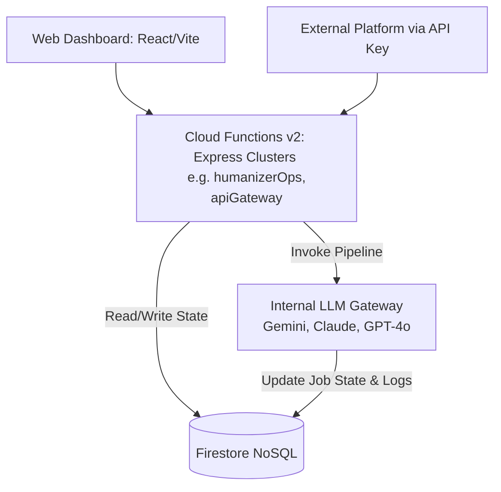

# Content Humanizer

Content Humanizer is a enterprise-ready **B2B SaaS and API-as-a-Service platform** designed to transform AI-generated text into highly authentic, human-like content that consistently bypasses modern AI detection systems (such as Originality.ai, GPTZero, and Turnitin).

Unlike basic paraphrasers that rely on superficial word-swapping, Content Humanizer utilizes a sophisticated **11-agent sequential pipeline** to perform deep content detoxification, structural disruption, and genuine voice synthesis.

The platform operates on a robust, synchronous architecture processing content humanization directly in the request-response cycle while logging transaction metrics to a Firestore database, enabling scalable API delivery, granular token/credit tracking, and enterprise-grade observability.

---

## 🚀 Core Value Proposition & Differentiators

1.  **The 11-Agent Detox Pipeline:** A multi-stage orchestration that dissects intent, eliminates AI structural patterns, injects sentence burstiness, and rigorously scores the output against internal detection simulations.
2.  **API-First Architecture:** A developer-ready REST API allowing seamless B2B integration via scoped API keys, returning humanized content and quality metrics directly in the synchronous HTTP response.
3.  **Transparent Credit & Token Economics:** Users purchase credits (1 credit = 10 words base rate) with compute multipliers for premium modes. The admin dashboard tracks LLM token consumption per agent per job to ensure healthy margins.
4.  **Comprehensive Quality Scoring:** Every output includes a structured JSON quality report: `input_ai_written_percent`, `human_likeness`, `ai_detection_resistance`, `readability`, `seo_retention`, `tone_consistency`, `grammar`, `overall`, and a natural-language `summary`.
5.  **SLA-Backed Bypass Guarantee:** Jobs run on `maximum` reflection level are guaranteed to achieve $\ge90$ AI detection resistance or the user is charged 0 credits.

---

## 🛠️ System Architecture



### Component Breakdown
*   **Frontend (`/webapp`):** React dashboard served via Firebase Hosting. Handles Playground, Voice Vault custom profiles, credit top-ups (Stripe integration), and developer key generation.
*   **API Gateway (Express Clusters):** Firebase Cloud Functions handling authentication (Firebase Auth or scoped API keys), rate limiting, and credit validation.
*   **Pipeline Execution:** Agent Workers execute the 11-agent pipeline synchronously inside the request-response lifecycle, avoiding asynchronous queuing delays.
*   **Database (Firestore):** Stores user profiles, API keys, credit balances, job states, task logs, and LLM consumption performance records.

---

## 🤖 The 11-Agent Pipeline Architecture

The humanization process is executed sequentially by specialized agents. While the conceptual model uses an 11-agent pipeline, the backend consolidates them into **6 optimized core execution stages** for maximum efficiency and latency control:

### Phase 1: Analysis & Strategy
*   **Agent 1 (Orchestrator & Planner):** Profiles the target audience, purpose, and tone fingerprint. Identifies what a human expert would add (voice gap analysis).
*   **Agent 2 (Sanitizer / Pattern Detection):** Flags exact statistical signatures detectors look for (perplexity uniformity, transitions, etc.) and surgically removes them. Calculates the baseline `input_ai_written_percent` score.

### Phase 2: Core Transformation
*   **Agent 3 (Linguistic Humanizer):** The core rewrite. Forces sentence length variation, unexpected synonyms, and breaks grammatical rules intentionally to match human flow.
*   **Agent 4 (Style & SEO Aligner):** Combines style personalization, authenticity, and SEO preservation. Applies the custom Voice Vault persona and makes sure keywords aren't lost.

### Phase 3: Reflection & Quality Assurance
*   **Agent 5 (Adversarial Evaluator):** Acts as the internal AI detector. Scores burstiness, perplexity, and structural diversity.
*   **Agent 6 (Revision Refiner):** Applies the Evaluator's feedback to aggressively fix remaining tells.
    > [!NOTE]
    > Agents 5 & 6 run in loops based on user-selected `reflection_level` (`basic` = 1 loop, `advanced` = 2 loops, `maximum` = 3 loops).
*   **Agent 7 (Final Polish):** A final cleanup pass that removes double spaces, trailing whitespace, and ensures clean formatting.

---

## ⚙️ Core Pipeline Configurations & Modes

### 10 AI Fingerprints Removed by Agent 2:
1.  **Robotic Transition Words:** Stripping words like *Moreover*, *Furthermore*, *Additionally*, *In conclusion*, *Notably*.
2.  **Over-Hedging Phrases:** Eliminating *it is possible that*, *one might argue*, *it can be said that*.
3.  **AI Cliché Words:** Replacing words like *delve*, *tapestry*, *beacon*, *testament*, *groundbreaking*, *leverage*, *utilize*, *robust*.
4.  **Formal Non-Contraction Pairs:** Converting *do not* $\rightarrow$ *don't*, *it is* $\rightarrow$ *it's*, *will not* $\rightarrow$ *won't*.
5.  **Over-Passive Constructions:** Actively rewriting passive voice to direct assertions.
6.  **Uniform Sentence Openers:** Varying structures if consecutive sentences start similarly.
7.  **Perfectly Balanced Lists:** Trimming list items to break suspicious symmetry.
8.  **Zero-Personality Language:** Replacing stale introductions with punchy assertions.
9.  **Abstract Generalities:** Using concrete, domain-specific alternatives.
10. **Missing Discourse Markers:** Adding natural conversational elements (e.g., *honestly*, *look*, *here's the thing*).

### Persona Mode Instructions:
*   **`standard`**: Natural humanization keeping structural elements intact. Targets a 12th-grade reading level.
*   **`human`**: Sounds like a casual conversation. Heavy use of contractions, colloquialisms, and fragments.
*   **`expert`**: Professional authority tone. Precise terminology but clean and accessible.
*   **`bypass`**: Maximum burstiness and voice flooding. Engineered strictly to pass detectors at all costs.

---

## 💰 Credit Economics & Pricing Multipliers

Credit consumption is locked on request start and charged upon success, or fully refunded if a terminal error occurs:

$$\text{Credits Charged} = \lceil\text{Base Credits} \times \text{Reflection Multiplier} \times \text{Voice Multiplier}\rceil$$

*   **Base Credits:** 1 Credit = 10 words processed.
*   **Reflection Multiplier:**
    *   `basic`: **1.0x**
    *   `advanced`: **1.5x**
    *   `maximum`: **2.0x**
*   **Voice Vault Multiplier:**
    *   Default Voice / Custom Vault Persona: **2.0x** (due to contextual DNS analysis overhead).
*   *Example:* A 500-word text processed under `maximum` reflection and using a Custom Voice profile will charge:
    $$\lceil 50 \times 2.0 \times 2.0 \rceil = 200\text{ Credits}$$
*   **Self-Hosted API Bypass:** If a user configures their own personal LLM keys (Gemini / OpenAI / OpenRouter API keys in settings), the platform **charges 0 credits** and handles model routing through their own credentials!

---

## 📊 Database Schema (Cloud Firestore)

### Collection: `users`
*   `email`: `string`
*   `credits`: `number` (remaining balance)
*   `role`: `string` (`user` or `admin`)
*   `geminiApiKey` / `openaiApiKey` / `openrouterApiKey`: `string` (optional, for self-hosted execution)
*   `createdAt`: `timestamp`

### Collection: `jobs`
*   `userId`: `string`
*   `inputText` / `outputText`: `string` (Raw text is temporarily tracked)
*   `wordsIn` / `wordsOut`: `number`
*   `mode` / `reflectionLevel`: `string`
*   `inputAiWrittenPercent` / `humanLikeness` / `aiResistance` / `qualityOverall`: `number`
*   `creditsUsed` / `tokensConsumed` / `llmCostUsd` / `processingMs`: `number`
*   `status`: `string` (`processing`, `completed`, `failed`, `cancelled`)
*   `agentLogs`: `array` of Maps containing latency, tokens, cost, and status per step.

### Collection: `creditTransactions`
*   `userId`: `string`
*   `type`: `string` (`deduction`, `refund`, `purchase`, `adjustment`)
*   `amount`: `number` (positive/negative integer credits)
*   `jobId`: `string`
*   `createdAt`: `timestamp`

### Collection: `tokenUsageLogs`
*   `userId` / `jobId` / `agentName` / `model`: `string`
*   `tokensIn` / `tokensOut` / `thinkingTokens`: `number`
*   `costUsd` / `latencyMs`: `number`
*   `createdAt`: `timestamp`

---

## ⚙️ Setup & Local Development

### Prerequisites
*   **Node.js** v22+
*   **Firebase CLI** (`npm install -g firebase-tools`)
*   Create a Firebase project in the Console.

### 1. Backend Setup (`/functions`)
```bash
cd functions
npm install

# Copy configuration template
cp .env.beta .env
```
Ensure you set the appropriate environment variables:
*   `GEMINI_API_KEY`: Google Generative AI key.
*   `OPENAI_API_KEY`: OpenAI API key.
*   `OPENROUTER_API_KEY`: OpenRouter gateway key.

To compile TypeScript and start the Firebase local emulator:
```bash
npm run serve
```
To run in standalone Express server mode (port 3000):
```bash
npm run build
npm run start
```

### 2. Frontend Setup (`/webapp`)
```bash
cd ../webapp
npm install

# Setup local environment variables
cp .env.example .env
```
Configure your client Firebase project keys inside `.env`.
To run the Vite local development server:
```bash
npm run dev
```

---

## 📡 API Reference

All requests must contain a valid Firebase ID Token or scoped API Key in the `Authorization` header.

### `/api/v1/humanize` (POST)
Starts a synchronous humanization execution pipeline.
*   **Request Payload:**
    ```json
    {
      "text": "Furthermore, it is important to note that artificial intelligence is growing rapidly.",
      "mode": "human",
      "reflection_level": "advanced",
      "voice_profile_id": "vp_default"
    }
    ```
*   **Response Payload:**
    ```json
    {
      "job_id": "job_xxxxxxxxxxxx",
      "status": "completed",
      "text": "Honestly, AI is just taking off super fast right now.",
      "words_in": 11,
      "words_out": 10,
      "processing_ms": 8450,
      "credits_deducted": 3,
      "quality_metrics": {
        "input_ai_written_percent": 85,
        "human_likeness": 94,
        "ai_detection_resistance": 96,
        "readability": 92,
        "overall": 92
      }
    }
    ```

### `/api/v1/detect` (POST)
Checks content for AI characteristics. Returns the baseline percentage score without running full pipeline rewrites.

### `/api/v1/checkout/credits` (POST)
Requests a secure payment link from Stripe.

### `/api/v1/keys` (POST)
Generates a scoped developer API Key (`hk_live_[32-bytes]`) stored in Firestore as a SHA-256 hash.

---

## 🛡️ Security & Zero-Retention
*   **Zero-Retention Content:** Content text is temporarily stored in private GCS buckets with a strict lifecycle of **7 days TTL (Time-to-Live)**. Afterwards, text is deleted, keeping only anonymous aggregate metadata scores in Firestore.
*   **PII Masking:** A regex filter runs pre-pipeline scrubbing Social Security numbers, credit card numbers, and high-risk personal IDs.
*   **Data Isolation:** All payloads are encrypted in transit using TLS 1.3 and at rest inside GCP/Firebase storage systems.
